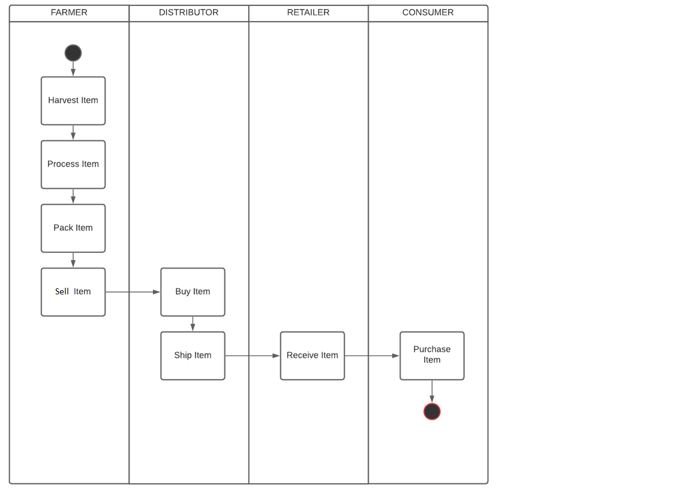
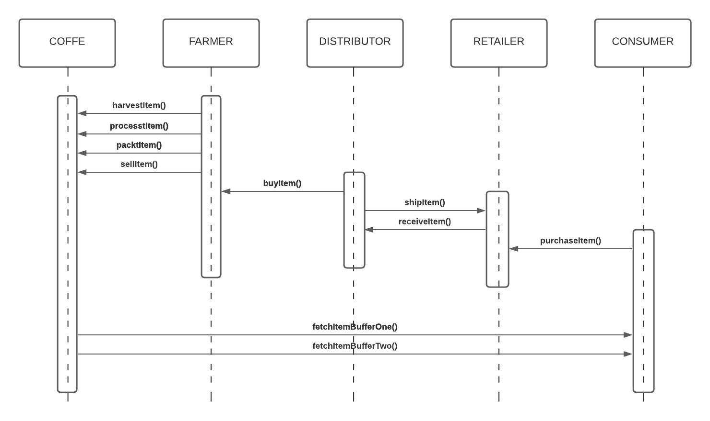
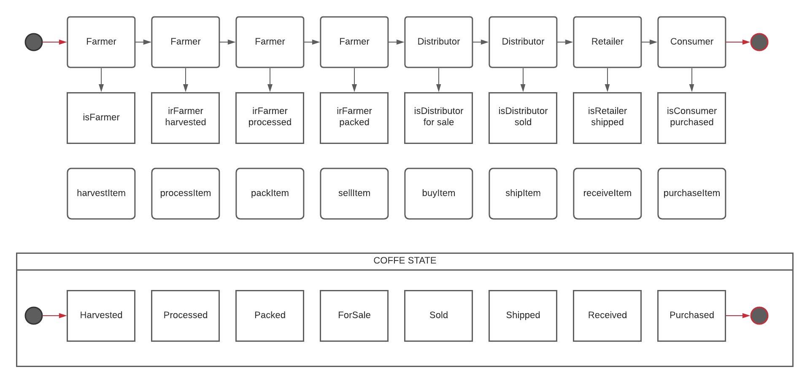
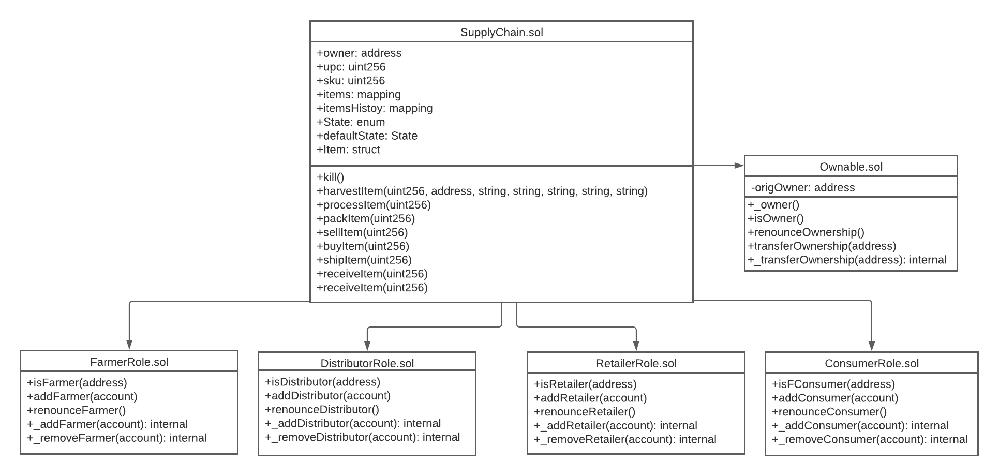

# UDACITY - BLOCKCHAIN DEVELOPER - PROJECT-3 - SUPPLY CHAIN - JAIME FIDALGO SANTOS
The project has been done using a template provided by udacity team (https://github.com/udacity/nd1309-Project-6b-Example-Template)

## Truffle Version
>
    Truffle v4.1.14 
>

## Node Version
>
    node v14.17.6
>

## web3 Version
>
    web3@1.6.0
>
## Contract Address
>
    0x3f74efc465df9e58f19259179d24782ad6db296c 
>
## Transaction Hash
>
    0xdcae8ba003132d514c01850ac708230455e859b38729745f3bd3197a8b59c362
>

## Requirement 1: Project write-up - UML

### Activity Diagram


### Sequence Diagram


### State Diagram


### Class Diagram (Data Model)


## Requirement 2: Project write-up - Libraries
For this project, Roles library is used. It makes easier to manage AccessControl in the DAPP by adding and removing roles in each of the AccessControl contracts (FarmerRole.sol, DistributorRole.sol, RetailerRole.sol, and ConsumerRole.sol).
In addition, truffle-hdwallet-provider library has been used to deploy the contract to the ropsten network. (See truffle.js file).

## Requirement 3: Project write-up - IPFS
No IPFS is used on this project

## Getting Started

These instructions will get you a copy of the project up and running on your local machine for development and testing purposes. See deployment for notes on how to deploy the project on a live system.

### Prerequisites

Please make sure you've already installed ganache-cli, Truffle and enabled MetaMask extension in your browser.

### Installing

A step by step series of examples that tell you have to get a development env running

Clone this repository


Change directory to ```project-6``` folder and install all requisite npm packages (as listed in ```package.json```):

```
cd project-6
npm install
```

Launch Ganache:

```
ganache-cli -m "spirit supply whale amount human item harsh scare congress discover talent hamster"
```

In a separate terminal window, Compile smart contracts:

```
truffle compile
```

This will create the smart contract artifacts in folder ```build\contracts```.

Migrate smart contracts to the locally running blockchain, ganache-cli:

```
truffle migrate
```

Test smart contracts:

```
truffle test
```

All 10 tests should pass.

In a separate terminal window, launch the DApp:

```
npm run dev
```